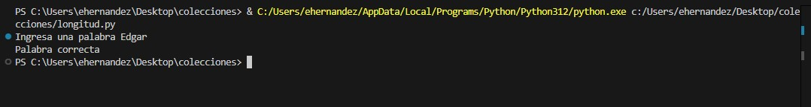
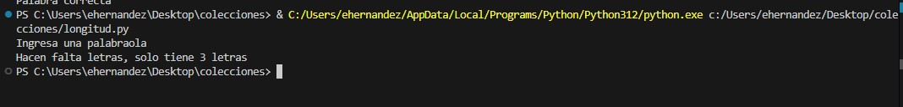
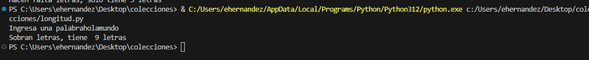
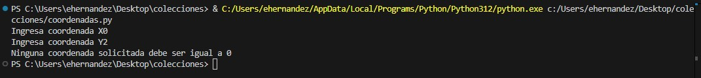
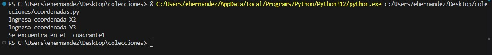
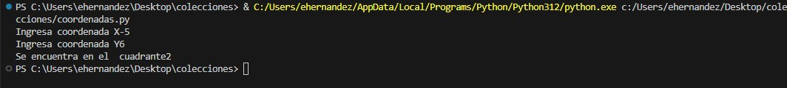
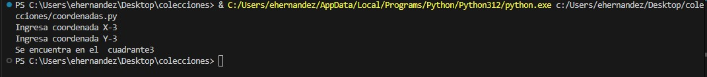
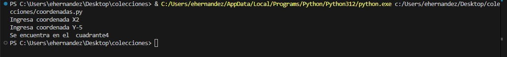

# Desarrollos
Desarrollo 1: Programa medición de palabra (longitud.py)
Desarrollo 2: Programa ubicación de coordenada en cuadrantes (coordenadas.py)
Opcional: EDGAR_HERNANDEZ_proyectoM2.py, contiene los dos desarrollos con los comentarios correspondientes, siguiendo las pautas del proyecto uCamp

## Desarrollado con
* Python

### Instruccciones
* Es necesario descargar Python en nuestra computadora desde el sitio oficial (https://www.python.org/)
* Una vez instalado Python, hay que clonar el repositorio - (https://github.com/wallace3/colecciones.git)
* Clonado el repositorio en nuestra maquina, hay que ejecutar el archivo longitud.py y coordenadas.py, según el software que deseemos.

### Cómo funciona longitud.py
* El programa solicita una palabra que el usuario debe ingresar
* El programa evalua que, si la palabra es menor a 4 caracteres, muestra en pantalla las letras con las que cuenta y que hacen falta. Si la palabra tiene más de 8 caracteres, muestra en pantalla que sobran letras y la cantidad 
* A continuación se muestran los caminos posibles.

 

### Cómo funciona coordenadas.py
* El programa solicita dos números, si alguno de los dos es igual a 0, el programa termina ya que deben ser mayores o menores.
* Se cuenta con una lista con los cuadrantes y su configuración
* En caso que los números ingresados sean correctos, se muestra en pantalla el cuadrante al que corresponde.
* A continuación se muestran los resultados posibles

### Autor
* Ing. Edgar Azael Hernández Bedolla

### Conocimientos y Agradecimientos
* Software desarollado gracias a los conocimientos básicos de uCamp en conjunto con UTEL Universidad
* Gracias a uCamp y sus profesores por el conocimiento compartido
* Python es un lenguaje de programación con bastante tiempo y en constante evolución en el cual me gustaría profesionalizarme.

